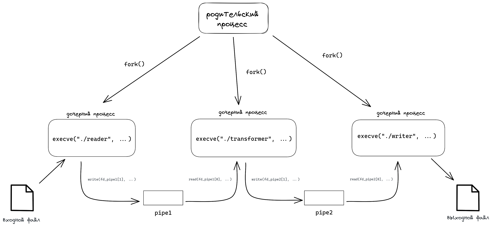
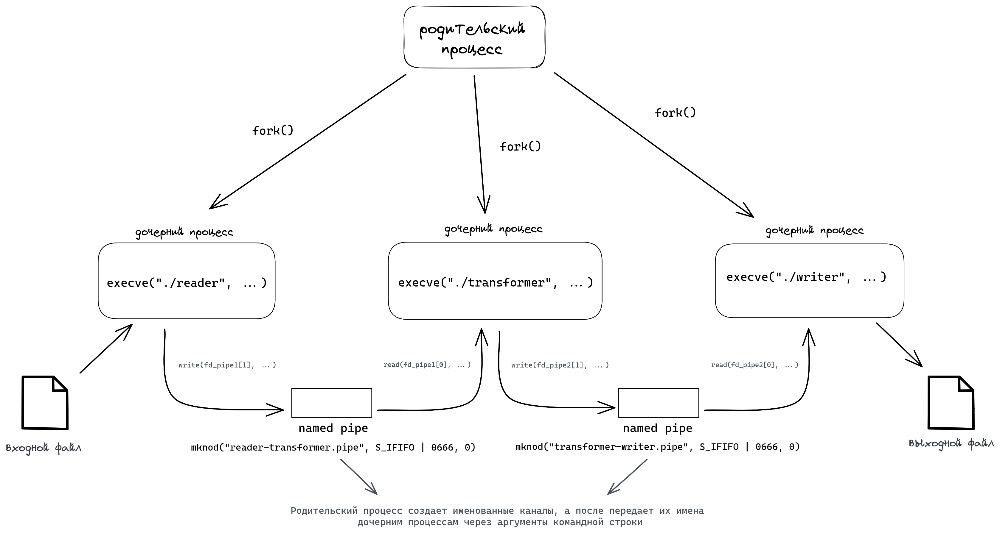

# Индивидуальное домашнее задание №1

#### Студент: Нечесов Андрей Львович
#### Группа: БПИ217
#### Вариант: 18

## Содержание
- [Условие задачи](#условие-задачи)
- [Тестирование](#тестирование)
  - [Набор тестов](#набор-тестов)
  - [Результаты работы на тестовых файлах](#результаты-работы-на-тестовых-файлах)
- [Критерии на 4 балла](#критерии-на-4-балла)
  - [Общая схема решаемой задачи](#общая-схема-решаемой-задачи)
  - [Консольное приложение](#разработано-консольное-приложение-использующее-неименованные-каналы)
    - [Исходный код](#исходный-код)
    - [Сборка программы](#сборка-программы)
    - [Формат работы с программой](#формат-работы-с-программой)
- [Критерии на 5 балла](#критерии-на-5-балла)
  - [Общая схема решаемой задачи](#d0b8d181d185d0bed0b4d0bdd18bd0b9-d0bad0bed0b4-1)
  - [Консольное приложение](#разработано-консольное-приложение-использующее-именованные-каналы)
    - [Исходный код](#d0b8d181d185d0bed0b4d0bdd18bd0b9-d0bad0bed0b4-1)
    - [Сборка программы](#d181d0b1d0bed180d0bad0b0-d0bfd180d0bed0b3d180d0b0d0bcd0bcd18b-1)
    - [Формат работы с программой](#d184d0bed180d0bcd0b0d182-d180d0b0d0b1d0bed182d18b-d181-d0bfd180d0bed0b3d180d0b0d0bcd0bcd0bed0b9-1)
  

## Условие задачи
>Разработать программу, заменяющую все согласные буквы в заданной ASCII-строке на заглавные.
## Тестирование
### Набор тестов
Был составлен набор тестов для проверки работы программы на следующих входных данных:
1. Строка "Hello, World!"
2. Многострочный текст с различными разделителями
3. Многострочный текст, состоящий только из гласных букв
4. Строка, состоящая только из согласных букв различного регистра
5. Строка с разделителями, цифрами и строчными согласными буквами
6. Пустой файл

Все тесты лежат в папке [tests/](tests/) и имеют в названии номер соответствующий списку выше.

### Результаты работы на тестовых файлах
Все результаты работы на тестовых файлах лежат в папке `<N>/tests/` и имеют в названии номер, соответствующий списку выше. `N` &mdash; папка с программой на оценку в N баллов.

## Критерии на 4 балла
### Общая схема решаемой задачи
<p align="center">

</p>

### Разработано консольное приложение, использующее неименованные каналы
#### Исходный код
Исходный код располагается в папке [4/](4/)  

Ввод и вывод данных при работе с файлами осуществляется через
системные вызовы `read` и `write`
#### Сборка программы
Сборка программы:
```commandline
cd 4
make
```
#### Формат работы с программой
```commandline
./program <filename_in> <filename_out>
```
`<filname_in>` &mdash; имя входного файла  
`<filename_out>` &mdash; имя выходного файла


## Критерии на 5 баллов
### Общая схема решаемой задачи
<p align="center">

</p>

### Разработано консольное приложение, использующее именованные каналы
#### Исходный код
Исходный код располагается в папке [5/](5/)  

Ввод и вывод данных при работе с файлами осуществляется через
системные вызовы `read` и `write`
#### Сборка программы
Сборка программы:
```commandline
cd 5
make
```
#### Формат работы с программой
```commandline
./program <filename_in> <filename_out>
```
`<filname_in>` &mdash; имя входного файла  
`<filename_out>` &mdash; имя выходного файла
