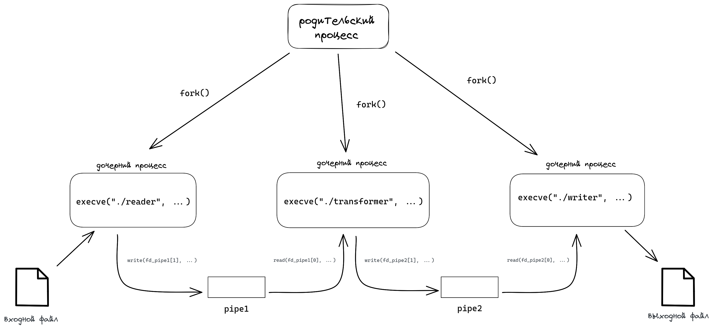
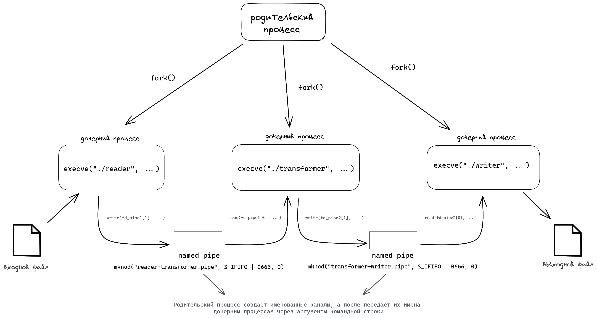
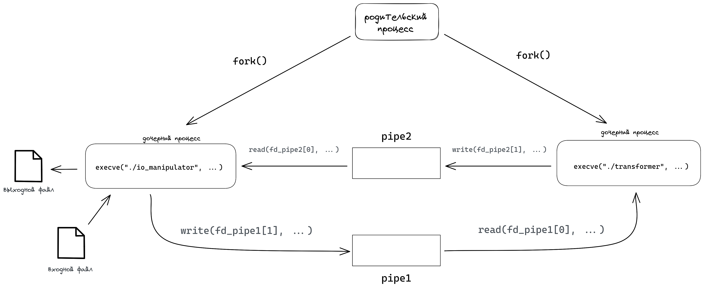
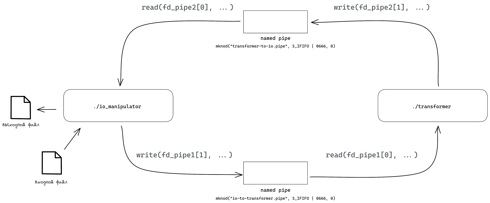

# Индивидуальное домашнее задание №1

#### Студент: Нечесов Андрей Львович
#### Группа: БПИ217
#### Вариант: 18

## Содержание
- [Условие задачи](#условие-задачи)
- [Тестирование](#тестирование)
  - [Набор тестов](#набор-тестов)
  - [Результаты работы на тестовых файлах](#результаты-работы-на-тестовых-файлах)
- [Критерии на 4 балла](#критерии-на-4-балла)
  - [Общая схема решаемой задачи](#общая-схема-решаемой-задачи)
  - [Консольное приложение](#разработано-консольное-приложение-использующее-неименованные-каналы)
    - [Исходный код](#исходный-код)
    - [Сборка программы](#сборка-программы)
    - [Формат работы с программой](#формат-работы-с-программой)
- [Критерии на 5 балла](#критерии-на-5-балла)
  - [Общая схема решаемой задачи](#общая-схема-решаемой-задачи-1)
  - [Консольное приложение](#разработано-консольное-приложение-использующее-именованные-каналы)
    - [Исходный код](#исходный-код-1)
    - [Сборка программы](#сборка-программы-1)
    - [Формат работы с программой](#формат-работы-с-программой-1)
  

## Условие задачи
>Разработать программу, заменяющую все согласные буквы в заданной ASCII-строке на заглавные.
## Тестирование
### Набор тестов
Был составлен набор тестов для проверки работы программы на следующих входных данных:
1. Строка "Hello, World!"
2. Многострочный текст с различными разделителями (размер файла составляет более 5000 байт)
3. Многострочный текст, состоящий только из гласных букв
4. Строка, состоящая только из согласных букв различного регистра
5. Строка с разделителями, цифрами и строчными согласными буквами
6. Пустой файл

Все тесты лежат в папке [tests/input/](tests/input/) и имеют в названии номер соответствующий списку выше.

### Скрипт для тестирования
Был написан скрипт `checker.py`. Он имеет следующую логику:  
1. Для каждого из тестовых файлов генерирует файл-ответ, который помещается в директорию [tests/answers](tests/answers/)
2. Для каждой из папок `grade<N>` собирает в ней программу, затем запускает исполняемый файл, подавая на вход тестовый файл. Так, для каждого теста генерируется ответ программы, который помещается в директорию `grade<N>/tests/output`
3. Скрипт сравнивает правильные ответы из [tests/answers](tests/answers/) с ответами программы  

Важно! Данный скрипт следует запускать только из корневой директории проекта.

### Результаты работы на тестовых файлах
Все результаты работы на тестовых файлах лежат в папке `grade<N>/tests/output/` и имеют в названии номер, соответствующий списку выше. `N` &mdash; папка с программой на оценку в N баллов.

## Сборка программ
Для сборки программ необходимо перейти в директорию с исходными кодами `grade<N>` и выполнить команду `make`

## Формат работы с программами
### Программы на оценку 4-7
```commandline
./program <filename_in> <filename_out>
```
`<filname_in>` &mdash; имя входного файла  
`<filename_out>` &mdash; имя выходного файла
### Программы на оценку 8-10
Либо в разных терминалах:
```commandline
./io_manipulator <filename_in> <filename_out>
```
`<filname_in>` &mdash; имя входного файла  
`<filename_out>` &mdash; имя выходного файла
```commandline
./transformer
```

Либо в одном терминале:
```commandline
./io_manipulator <filename_in> <filename_out> &
./transformer
```
`<filname_in>` &mdash; имя входного файла  
`<filename_out>` &mdash; имя выходного файла

## Критерии на 4 балла
### Общая схема решаемой задачи
<p align="center">

</p>

### Исходные коды

Исходный код располагается в папке [grade4/](grade4/)  

### Результаты работы


## Критерии на 5 баллов
### Общая схема решаемой задачи
<p align="center">

</p>

### Исходные коды

Исходный код располагается в папке [grade5/](grade5/)  

### Результаты работы

## Критерии на 6 баллов
### Общая схема решаемой задачи
<p align="center">

</p>

### Исходные коды

Исходный код располагается в папке [grade6/](grade6/)  

### Результаты работы

## Критерии на 7 баллов
### Общая схема решаемой задачи
<p align="center">

</p>

### Исходные коды

Исходный код располагается в папке [grade7/](grade7/)  

### Результаты работы

## Критерии на 8 баллов
### Общая схема решаемой задачи
<p align="center">

</p>

### Исходные коды

Исходный код располагается в папке [grade8/](grade8/)  

### Результаты работы


## Критерии на 9 баллов
### Общая схема решаемой задачи
<p align="center">

</p>

### Исходные коды

Исходный код располагается в папке [grade9/](grade9/)  

### Результаты работы