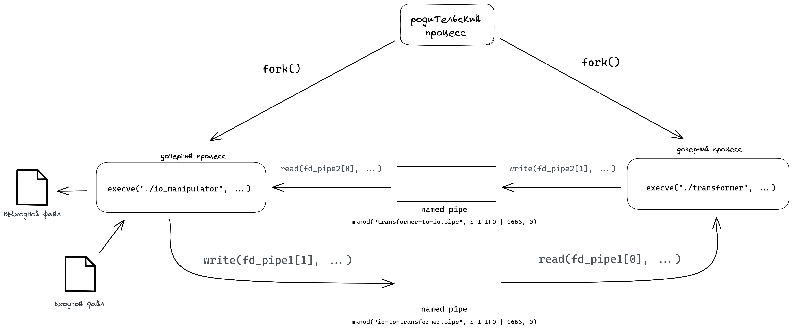

# Индивидуальное домашнее задание №1

#### Студент: Нечесов Андрей Львович
#### Группа: БПИ217
#### Вариант: 18

## Содержание
- [Условие задачи](#%D1%83%D1%81%D0%BB%D0%BE%D0%B2%D0%B8%D0%B5-%D0%B7%D0%B0%D0%B4%D0%B0%D1%87%D0%B8)
- [Тестирование](#%D1%82%D0%B5%D1%81%D1%82%D0%B8%D1%80%D0%BE%D0%B2%D0%B0%D0%BD%D0%B8%D0%B5)
  * [Набор тестов](#%D0%BD%D0%B0%D0%B1%D0%BE%D1%80-%D1%82%D0%B5%D1%81%D1%82%D0%BE%D0%B2)
  * [Скрипт для тестирования](#%D1%81%D0%BA%D1%80%D0%B8%D0%BF%D1%82-%D0%B4%D0%BB%D1%8F-%D1%82%D0%B5%D1%81%D1%82%D0%B8%D1%80%D0%BE%D0%B2%D0%B0%D0%BD%D0%B8%D1%8F)
  * [Результаты работы на тестовых файлах](#%D1%80%D0%B5%D0%B7%D1%83%D0%BB%D1%8C%D1%82%D0%B0%D1%82%D1%8B-%D1%80%D0%B0%D0%B1%D0%BE%D1%82%D1%8B-%D0%BD%D0%B0-%D1%82%D0%B5%D1%81%D1%82%D0%BE%D0%B2%D1%8B%D1%85-%D1%84%D0%B0%D0%B9%D0%BB%D0%B0%D1%85)
  * [Пример результата запуска скрипта](#%D0%BF%D1%80%D0%B8%D0%BC%D0%B5%D1%80-%D1%80%D0%B5%D0%B7%D1%83%D0%BB%D1%8C%D1%82%D0%B0%D1%82%D0%B0-%D0%B7%D0%B0%D0%BF%D1%83%D1%81%D0%BA%D0%B0-%D1%81%D0%BA%D1%80%D0%B8%D0%BF%D1%82%D0%B0)
- [Сборка программ](#%D1%81%D0%B1%D0%BE%D1%80%D0%BA%D0%B0-%D0%BF%D1%80%D0%BE%D0%B3%D1%80%D0%B0%D0%BC%D0%BC)
- [Формат работы с программами](#%D1%84%D0%BE%D1%80%D0%BC%D0%B0%D1%82-%D1%80%D0%B0%D0%B1%D0%BE%D1%82%D1%8B-%D1%81-%D0%BF%D1%80%D0%BE%D0%B3%D1%80%D0%B0%D0%BC%D0%BC%D0%B0%D0%BC%D0%B8)
  * [Программы на оценку 4-7](#%D0%BF%D1%80%D0%BE%D0%B3%D1%80%D0%B0%D0%BC%D0%BC%D1%8B-%D0%BD%D0%B0-%D0%BE%D1%86%D0%B5%D0%BD%D0%BA%D1%83-4-7)
  * [Программы на оценку 8-10](#%D0%BF%D1%80%D0%BE%D0%B3%D1%80%D0%B0%D0%BC%D0%BC%D1%8B-%D0%BD%D0%B0-%D0%BE%D1%86%D0%B5%D0%BD%D0%BA%D1%83-8-10)
- [Критерии на 4 балла](#%D0%BA%D1%80%D0%B8%D1%82%D0%B5%D1%80%D0%B8%D0%B8-%D0%BD%D0%B0-4-%D0%B1%D0%B0%D0%BB%D0%BB%D0%B0)
  * [Общая схема решаемой задачи](#%D0%BE%D0%B1%D1%89%D0%B0%D1%8F-%D1%81%D1%85%D0%B5%D0%BC%D0%B0-%D1%80%D0%B5%D1%88%D0%B0%D0%B5%D0%BC%D0%BE%D0%B9-%D0%B7%D0%B0%D0%B4%D0%B0%D1%87%D0%B8)
  * [Исходный код](#%D0%B8%D1%81%D1%85%D0%BE%D0%B4%D0%BD%D1%8B%D0%B9-%D0%BA%D0%BE%D0%B4)
  * [Результаты работы](#%D1%80%D0%B5%D0%B7%D1%83%D0%BB%D1%8C%D1%82%D0%B0%D1%82%D1%8B-%D1%80%D0%B0%D0%B1%D0%BE%D1%82%D1%8B)
- [Критерии на 5 баллов](#%D0%BA%D1%80%D0%B8%D1%82%D0%B5%D1%80%D0%B8%D0%B8-%D0%BD%D0%B0-5-%D0%B1%D0%B0%D0%BB%D0%BB%D0%BE%D0%B2)
  * [Общая схема решаемой задачи](#%D0%BE%D0%B1%D1%89%D0%B0%D1%8F-%D1%81%D1%85%D0%B5%D0%BC%D0%B0-%D1%80%D0%B5%D1%88%D0%B0%D0%B5%D0%BC%D0%BE%D0%B9-%D0%B7%D0%B0%D0%B4%D0%B0%D1%87%D0%B8-1)
  * [Исходный код](#%D0%B8%D1%81%D1%85%D0%BE%D0%B4%D0%BD%D1%8B%D0%B9-%D0%BA%D0%BE%D0%B4-1)
  * [Результаты работы](#%D1%80%D0%B5%D0%B7%D1%83%D0%BB%D1%8C%D1%82%D0%B0%D1%82%D1%8B-%D1%80%D0%B0%D0%B1%D0%BE%D1%82%D1%8B-1)
- [Критерии на 6 баллов](#%D0%BA%D1%80%D0%B8%D1%82%D0%B5%D1%80%D0%B8%D0%B8-%D0%BD%D0%B0-6-%D0%B1%D0%B0%D0%BB%D0%BB%D0%BE%D0%B2)
  * [Общая схема решаемой задачи](#%D0%BE%D0%B1%D1%89%D0%B0%D1%8F-%D1%81%D1%85%D0%B5%D0%BC%D0%B0-%D1%80%D0%B5%D1%88%D0%B0%D0%B5%D0%BC%D0%BE%D0%B9-%D0%B7%D0%B0%D0%B4%D0%B0%D1%87%D0%B8-2)
  * [Исходный код](#%D0%B8%D1%81%D1%85%D0%BE%D0%B4%D0%BD%D1%8B%D0%B9-%D0%BA%D0%BE%D0%B4-2)
  * [Результаты работы](#%D1%80%D0%B5%D0%B7%D1%83%D0%BB%D1%8C%D1%82%D0%B0%D1%82%D1%8B-%D1%80%D0%B0%D0%B1%D0%BE%D1%82%D1%8B-2)
- [Критерии на 7 баллов](#%D0%BA%D1%80%D0%B8%D1%82%D0%B5%D1%80%D0%B8%D0%B8-%D0%BD%D0%B0-7-%D0%B1%D0%B0%D0%BB%D0%BB%D0%BE%D0%B2)
  * [Общая схема решаемой задачи](#%D0%BE%D0%B1%D1%89%D0%B0%D1%8F-%D1%81%D1%85%D0%B5%D0%BC%D0%B0-%D1%80%D0%B5%D1%88%D0%B0%D0%B5%D0%BC%D0%BE%D0%B9-%D0%B7%D0%B0%D0%B4%D0%B0%D1%87%D0%B8-3)
  * [Исходный код](#%D0%B8%D1%81%D1%85%D0%BE%D0%B4%D0%BD%D1%8B%D0%B9-%D0%BA%D0%BE%D0%B4-3)
  * [Результаты работы](#%D1%80%D0%B5%D0%B7%D1%83%D0%BB%D1%8C%D1%82%D0%B0%D1%82%D1%8B-%D1%80%D0%B0%D0%B1%D0%BE%D1%82%D1%8B-3)
- [Критерии на 8 баллов](#%D0%BA%D1%80%D0%B8%D1%82%D0%B5%D1%80%D0%B8%D0%B8-%D0%BD%D0%B0-8-%D0%B1%D0%B0%D0%BB%D0%BB%D0%BE%D0%B2)
  * [Общая схема решаемой задачи](#%D0%BE%D0%B1%D1%89%D0%B0%D1%8F-%D1%81%D1%85%D0%B5%D0%BC%D0%B0-%D1%80%D0%B5%D1%88%D0%B0%D0%B5%D0%BC%D0%BE%D0%B9-%D0%B7%D0%B0%D0%B4%D0%B0%D1%87%D0%B8-4)
  * [Исходный код](#%D0%B8%D1%81%D1%85%D0%BE%D0%B4%D0%BD%D1%8B%D0%B9-%D0%BA%D0%BE%D0%B4-4)
  * [Результаты работы](#%D1%80%D0%B5%D0%B7%D1%83%D0%BB%D1%8C%D1%82%D0%B0%D1%82%D1%8B-%D1%80%D0%B0%D0%B1%D0%BE%D1%82%D1%8B-4)
- [Критерии на 9 баллов](#%D0%BA%D1%80%D0%B8%D1%82%D0%B5%D1%80%D0%B8%D0%B8-%D0%BD%D0%B0-9-%D0%B1%D0%B0%D0%BB%D0%BB%D0%BE%D0%B2)
  * [Общая схема решаемой задачи](#%D0%BE%D0%B1%D1%89%D0%B0%D1%8F-%D1%81%D1%85%D0%B5%D0%BC%D0%B0-%D1%80%D0%B5%D1%88%D0%B0%D0%B5%D0%BC%D0%BE%D0%B9-%D0%B7%D0%B0%D0%B4%D0%B0%D1%87%D0%B8-5)
  * [Исходный код](#%D0%B8%D1%81%D1%85%D0%BE%D0%B4%D0%BD%D1%8B%D0%B9-%D0%BA%D0%BE%D0%B4-5)
  * [Результаты работы](#%D1%80%D0%B5%D0%B7%D1%83%D0%BB%D1%8C%D1%82%D0%B0%D1%82%D1%8B-%D1%80%D0%B0%D0%B1%D0%BE%D1%82%D1%8B-5)
  
## Условие задачи
>Разработать программу, заменяющую все согласные буквы в заданной ASCII-строке на заглавные.
## Тестирование
### Набор тестов
Был составлен набор тестов для проверки работы программы на следующих входных данных:
1. Строка "Hello, World!"
2. Многострочный текст с различными разделителями (размер файла составляет более 5000 байт)
3. Многострочный текст, состоящий только из гласных букв
4. Строка, состоящая только из согласных букв различного регистра
5. Строка с разделителями, цифрами и строчными согласными буквами
6. Пустой файл

Все тесты лежат в папке [tests/input/](tests/input/) и имеют в названии номер соответствующий списку выше.

### Скрипт для тестирования
Был написан скрипт `checker.py`. Он имеет следующую логику:  
1. Для каждого из тестовых файлов генерирует файл-ответ, который помещается в директорию [tests/answers](tests/answers/)
2. Для каждой из папок `grade<N>` собирает в ней программу, затем запускает исполняемый файл, подавая на вход тестовый файл. Так, для каждого теста генерируется ответ программы, который помещается в директорию `grade<N>/tests/output`
3. Скрипт сравнивает правильные ответы из [tests/answers](tests/answers/) с ответами программы  

Важно! Данный скрипт следует запускать только из корневой директории проекта.

### Результаты работы на тестовых файлах
Все результаты работы на тестовых файлах лежат в папке `grade<N>/tests/output/` и имеют в названии номер, соответствующий списку выше. `N` &mdash; папка с программой на оценку в N баллов.

### Пример результата запуска скрипта
<p align="center">

</p>

## Сборка программ
Для сборки программ необходимо перейти в директорию с исходными кодами `grade<N>` и выполнить команду `make`

## Формат работы с программами
### Программы на оценку 4-7
```commandline
./program <filename_in> <filename_out>
```
`<filename_in>` &mdash; имя входного файла  
`<filename_out>` &mdash; имя выходного файла
### Программы на оценку 8-10
Либо в разных терминалах:
```commandline
./io_manipulator <filename_in> <filename_out>
```
`<filename_in>` &mdash; имя входного файла  
`<filename_out>` &mdash; имя выходного файла
```commandline
./transformer
```

Либо в одном терминале:
```commandline
./io_manipulator <filename_in> <filename_out> &
./transformer
```
`<filename_in>` &mdash; имя входного файла  
`<filename_out>` &mdash; имя выходного файла

## Критерии на 4 балла
### Общая схема решаемой задачи
<p align="center">

</p>

### Исходный код
Исходный код располагается в папке [grade4/](grade4/)  

### Результаты работы
Написана программа, которая порождает 3 дочерних процесса. В свою очередь, каждый из дочерних процессов выполняет некоторый пользовательский сценарий: чтение из файла, обработка строки и замена в ней символов, запись в файл. Общение между дочерними процессами происходит через неименованные pipe. Каналы создаются и открываются родительским процессом, дочерние процессы получают дескрипторы через аргументы командной строки. Размер буфера составляет 5000 байт.

## Критерии на 5 баллов
### Общая схема решаемой задачи
<p align="center">

</p>

### Исходный код

Исходный код располагается в папке [grade5/](grade5/)  

### Результаты работы
Написана программа, логика работы которой такая же, как и у программы на оценку в 4 балла. За исключением того, что вместо дескрипторов дочерним процессам передаются имена каналов, через которые они будут взаимодействовать.

## Критерии на 6 баллов
### Общая схема решаемой задачи
<p align="center">

</p>

### Исходный код
Исходный код располагается в папке [grade6/](grade6/)  

### Результаты работы
Написана программа, в которой порождается 2 дочерних процесса. Устанавливается двухстороннее взаимодействие между этими двумя процессами посредством создания двух неименованных каналов.

## Критерии на 7 баллов
### Общая схема решаемой задачи
<p align="center">

</p>

### Исходный код
Исходный код располагается в папке [grade7/](grade7/)  

### Результаты работы
Доработана программа на оценку в 6 баллов. Теперь дочерние процессы используют для общения именованные каналы вместо неименованных.

## Критерии на 8 баллов
### Общая схема решаемой задачи
<p align="center">

</p>

### Исходный код
Исходный код располагается в папке [grade8/](grade8/)  

### Результаты работы
Написано две программы, которые общаются между собой через именованные каналы.


## Критерии на 9 баллов
### Общая схема решаемой задачи
<p align="center">

</p>

### Исходный код

Исходный код располагается в папке [grade9/](grade9/)  

### Результаты работы
Доработана программа на 8 баллов, теперь размер буфера составляет не 5000 байт, а 100. Так как изначально была построена удачная структура программ, для доработки программы пришлось лишь изменить значение константы в `constants.h`